

  

[inVital Health Centre](https://jamesbirchall-dev.github.io/Invital-Health-Centre/) is a locally established health centre and gym and the design is to reflect its business mission as an accessible and affordable community health club whilst boasting quality fitness classes and equipment. With a heavy focus on it's niche, a Health Forum, which is an innotive approach to gym classes with the aim of growing a community of money saving and healthy life tips also with the aim of increasing off-peak memberships to make the most of its on-site capacity.  

## Table of Contents
1. 

    
<a href="#ux">UX</a>

    <ul>
    <li>

    
<a href="#goals">Goals</a>

    - [Visitor Goals](#visitor-goals)
    - [Business Goals](#business-goals)
    - [User Stories](#user-stories)
    
</li>

    <li>

    
<a href="#visual-design">Visual Design</a>

    - [Wireframes](#wireframes)
    - [Fonts](#fonts)
    - [Icons](#icons)
    - [Colors](#colors)
    - [Images](#images)
    - [Styling](#styling)
    
</li>
    </ul>

2. 

    
<a href="#features">Features</a>

    <ul>
    <li>

    
<a href="#page-elements">Page Elements</a>

     - [All Pages](#all-pages)
     - [Navigation](#navbar)
	   - [Footer](#footer)
     - [Index Page]{#index-page)
     - [Carousel with Captions](#carousel-with-captions)
     - [Service Card Section](#service-card-section)
     - [Mission Statement Section](#mission-statement-section_
     - [Take the Tour Video Section](#take-the-tour-video-section)
     - [Classes Page](#classes-page)
     - [Contact Page](#contact-page)
     - [Register Page](#register-page)
     - [Success Page](#success-page)
     - [Contact Form](#contact-form)
    
</li> 

    <li>

    
<a href="#feature-ideas">Feature Ideas</a>

    - [Future Developement Ideas](#future-developement-ideas)
    - [Content](#content)
    
</li>
    </ul>

3. 

    
<a href="#technologies-used">Technologies Used</a>

    - [Languages](#languages)
    - [Frameworks](#frameworks)
    - [Libraries](#libraries)
  

4. 

    
<a href="#testing">Testing</a>

    <ul>
    <li>

    
<a href="#methods">Methods</a>

    - [Validation](#validation)
    - [General Testing](#general-testing)
    - [User Stories Testing](#user-stories-testing)
    - [Mobile Testing](#mobile-testing)
    - [Desktop Testing](#desktop-testing)
    - [Functionality & Navigation by Browser and Device](#functionality-and-navigation-by-browser-and-device)
    - [Lighthouse Testing](#lighthouse-testing)

    
</li>

    <li>

    
<a href="#bugs">Bugs</a>

 
    </ul>

5. 

    
<a href="#deployment">Deployment</a>

    <ul>
    <li>

    
<a href="#local-deployment">Local Deployment</a>

    - [Local Preparation](#local-preparation)
    - [Local Instructions](#local-instructions)
    
</li>

    <li>

    
<a href="#github-deployment">Github Deployment</a>

    - [Github Preparation](#github-preparation)
    - [Github Instructions](#github-instructions)
    
</li>
    </ul>

6. 

    
<a href="#credit-and-contact">Credit and Contact</a>

    - [Content](#content)
    - [Contact](#contact)

----

# UX
## Goals
### Visitor Goals
The target audience for inVital are:
- Parents of school age children. 
- People who are interested in living healthily at the cheapest cost. 
- Regular gym goers.
- People interested in fitness classes.

User goals are:
- Explore the onsite facilities.
- Enrol as a member. 
- Contact the gym.
- Explore the different classes membership offers. 
- Find out where the gym is located. 

inVital Health Centre fills these needs by:
- A home page that navigates easily to any part of the website.
- Take the tour youtube video showing all site facilities. 
- Both join and contact page options in the header. 
- Advertise join and discount for membership in the landing page. 
- A classes page detailing each fitness and health forum on-site classes. 
- Providing an interactive map with an info-box that displays address and contact number

### Business Goals
The Business Goals of inVital Health Centre are:
1. Increase in off-peak membership ratio. 
2. General increase in traffic and membership enrolment. 
3. Reduce onsite admin time. 
4 Increase in the 'Health Forum' class enrolment. 

### User Stories
1. As a user interested in joining a gym, I want an easy to navigate website with all the information easy to find.
2. I expect to be able to find out what facilities and classes the gym has.
3. I expect to be able to register to join as a member.
4. I expect to be able to contact and find the health centre. 
5. I expect to see imagery which is health focussed. 
6. I expect to be able to read more detailed information about the classes.
7. I expect to be able to follow the health centre through social media.

## Visual Design
### Wireframes
Wireframes:
Index page

  

Classes page

  

Contact page

  

Contact form

  

Register form

  

### Fonts

  

--primary-font: "Montserrat", sans-serif;
Is bold and a favourite for headings. It has very strong geometric values, with curves in the lettering not too tight making it more accessible for people with reading difficulties. ie. dyslexic readers. 

--secondary-font: "Varela", sans-serif;
Modern, clean and minimalists making good contrast with the primary font yet still being in the same family, boasts the same accessibility 
for people with reading difficulties. ie. dyslexic reader. Applied to 
 text. 

### Icons

  

- Icons are taken from the [Bootstrap](https://cdn.jsdelivr.net/npm/bootstrap-icons/font/bootstrap-icons.css) Icon library and are utilised as classes in the `<i>` tag.
- As they are utilised as classes, they can easily be styled using other classes or IDs in the same tag. I used Bootstrap classes to style them uniformly.
- Icons are utilised in the footer for social account icons and are styled with a hover over animation and colored for high contrast, readability against the footer. 

### Colors

  

- Using a lifestyle photo with a color picker to determine the main color pallet. Blues and greens for health and nurturing impact as per the company branding. 
- primary-color: #1f2226; /* Blue Fantastic */ A dark blue for a clean dark backdrop
- secondary-color: #cfe0f4; /*light breeze */ A high contrasting blue to compliment the dark backdrop.
- Transparent Teal: rgba(179, 255, 241, 0.6) used for text to ensure readability against the image back ground and good contrast with the blue pallet so the site is not too monotonal. 
- Bootstrap buttons blue rgba (13,110,253) kept as provides a bold blue contrast, making it stand out whilst still being complimentry to the color pallet.  

### Images

  

- sourced from [istockphoto](https://www.istockphoto.com/).
- Used for carousel, service cards, classes and site photo. 
- Chosen for color use, a lot of cool blues and greens.
- Chosen for diveristy and a heavy focus on clean & professional look. 

Background image: 

  

- Gym machines in daylight chosen for color and branding, provides a good contrast with the deep blues.
- Blurred chosen to not intefere with the foreground content. 

### Styling
- For this project I have utilised Bootstrap 5 classes  and custom CSS to set primary and secondary colors accross the site making for easy updates.
- Transparent Teal backgrounds used for most pages in order for background image to blend but still have high contrast for readability.
- Transparent Black background used for text and CTA in the carousel to avoid color clashing with the image.  
- Transparent Teal exception is with the contact page, as the Teal will clash with the googlemap feature . 
- Bootstrap classes used for service layouts and CTA buttons making for easier stacking for each device. 
----

# Features
## Page Elements
### All Pages
#### Navbar
Desktop/Laptop Nav

  

Tablet Nav (Collapsed & expanded)

  
  
  

Mobile Nav (Collapsed & expanded)

  
   
    

- The Navbar is simple, providing links to the 3 main pages: Home, Contact and Classes.
- Button also in the nav for 'Join' which directs user to the Register page. This stands out more than the other links to make the registration process easy and more likely.  
- Hover over functionality  on links. 
- On smaller devices, the menu becomes collapsible.
- Bootstrap 5 elements broken down in this sheet https://docs.google.com/document/d/1BvyNlDbG85mt_AnDzTFATYOsyBalbLm7DthT1MtFjgA/edit?usp=sharing

#### Footer
Mobile

  

Tablet

  

- Located at the bottom of every page, a simple approach like with the nav.
- 3 centered icons to make for elegant transition with smaller devices.  
- Hover over functionality and high contrast icons against the footer background. 

### Index Page

The homepage has been designed to maximise navigation and information within landing view, whilst upholding the asthetic of the site. 
This is acheived with a sliding carousel with 3 slides, each directing to a part of the site, then the service cards below providing more information and a bolder text on background to stand out in the page.  You will see a mission statement below this to provide more information on branding then finally a tour video fo the user to browse the facilities. 

#### Carousel With Captions
- Using [Bootstrap](https://getbootstrap.com/docs/4.0/components/carousel/) as a template. 
- 3 x images on automatic change.  [Index Bootstrap Elements](https://docs.google.com/document/d/1Lz-XzIniIzwuXU_tz8ReggDIRi7KBWEWQR4D297tFEI/edit?usp=sharing)
- Caption text with Call to Action button linking to Classes & Register-Form (removed for mobile devices as too small to be interactive).
- White indicators and text for contrast against images. 
Desktop/Laptop

  

Tablet

  

Mobile

  

#### Service Card Section

- Using [Bootstrap Cards](https://getbootstrap.com/docs/4.0/components/card/) class as a template with manual CSS to adjust colors and sizing. 
- After the carousel and main header, service cards x 4 to provide a preview to other pages on the site all with Call to Action buttons to direct the user. 
- 4 in a row Desktop.

  

- 2 for Tablet. 

  

- 1 for Mobile. 

  

#### Mission Statement Section
- Using Bootstrap 'flex-container' class for screen size adjustment. 
- Content centred with left aligned text. 
- Section text using the Transparent Teal for consistancy. 
- Main text body using off-white/ light blue for better contrast with a large body of text.  

  

  

  

#### Take the Tour Video Section
To allow users to see the Health Centre's facilities in more detail, key for users who want to see what gym equipment is available.

- Embedded youtube video using Bootstrap 'video-container' class for screen size adjustment. 
- Fixed height 
- 16:9 Aspect ratio maintained by youtube when the video is played. 
- Shown in container with consistant Transparent Teal background. 

  

  

### Classes Page
The primary purpose of this page is to show the user what kind of classes the gym has to offer members, as with the Business Goal of promoting the new 'Health Forum', this sits at the top of the page as priority and with the flexible bootstrap classes, it makes for a good experience with scrolling on hand held devices. 

  

- Bootstrap 5 elements broken down in this sheet [Classes Bootastrap Elements](https://docs.google.com/document/d/1tN2jn3ORCs-YBwR9UFiZBwcn5GD6hB5dueIYM0cXcoE/edit?usp=sharing)

  

Text box aligns to the center of the image horizontally with image to the right.

  

Image stacks underneath for tablet ensuring text information has reading priority. 

  

Spacing between class containers to seperate them visually whilst optimising space. 

### Contact Page
The purpose of this page is to provide the neccessary information to contact the business, with a primary focus on trying to get the user to choose form contact over the phone (whilst making this accessible still).
-  Bootstrap 5 elements broken down in this sheet [Contact Bootastrap Elements](https://docs.google.com/document/d/1XieEHmNwVU2Tya-WhcT6FXTDByMCNL7RiMXEJUwkH3U/edit?usp=sharing)

  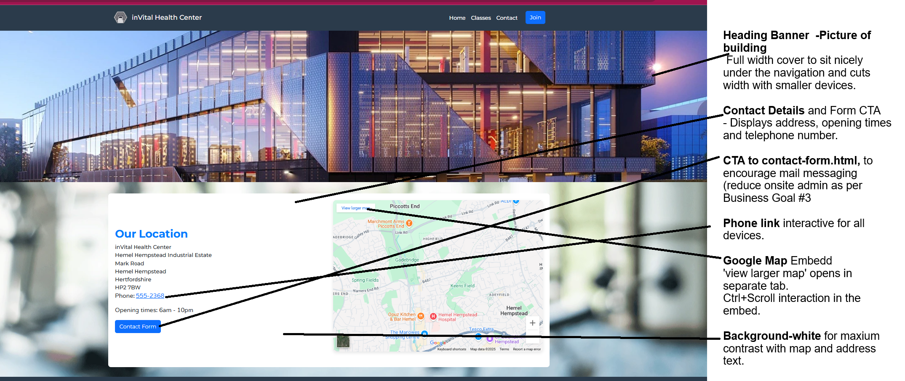

  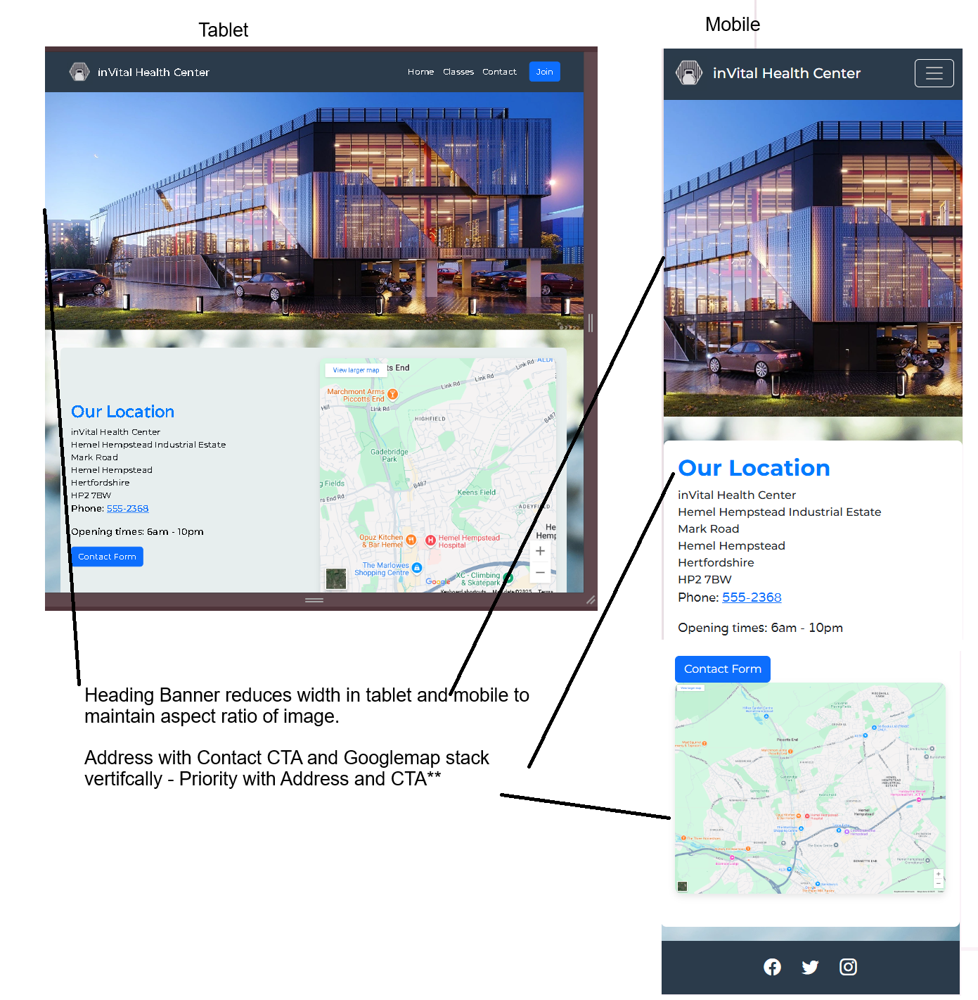

## Register Page 
This page is designed to easily display membership pricing information and for the user to be able to submit interest for membership (with the kind of membership they want) and their contact details for the staff at the gym to prepare for the appropiate next steps with the user. 

-  Bootstrap 5 elements broken down in this sheet [Register Bootastrap Elements](https://docs.google.com/document/d/18ECCWaVpi4yynrV19uudBJnjc3bctX6IdtXs8tG1UtA/edit?usp=sharing)

  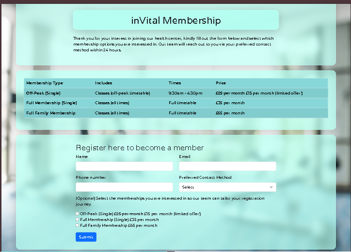

- Heading and welcome text informing user of expected turn around for response. 
- Membership table detailing pricing and discount for Business Goal.
- Form with optional checkbox and mandatory text fields, along with warnings. 
- Button directing to success.html - Only if mandatory form elenment criteria met. 

  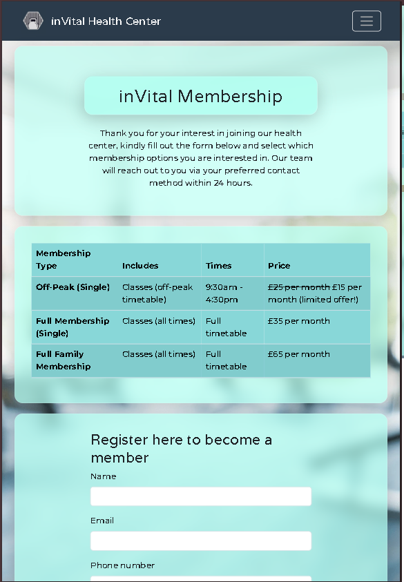

- Membership table wraps with smaller device. 

  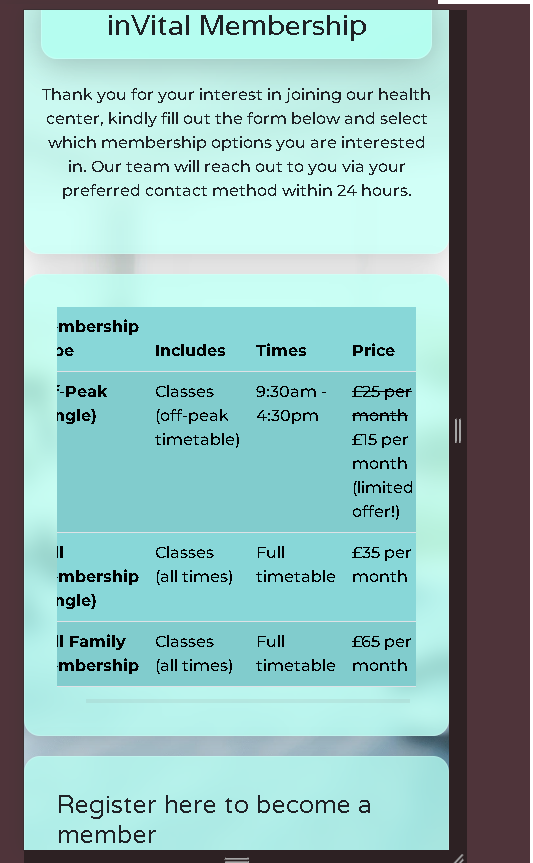

- Overflow enables horizontal scroll bar to view all table information. 

## Success Page
This page confirms to the user that their message has been sent. This page directs both from the contact-form.html and register-form.html submissions. It also allows for easy navigation back to the home page so they can continue browsing the site. 

-  Bootstrap 5 elements broken down in this sheet [Success Bootastrap Elements](https://docs.google.com/document/d/1tST-KRPXV6kTPkd2zjjJlJLHd1KfleX0C8LjhUV5xd4/edit?usp=sharing)

  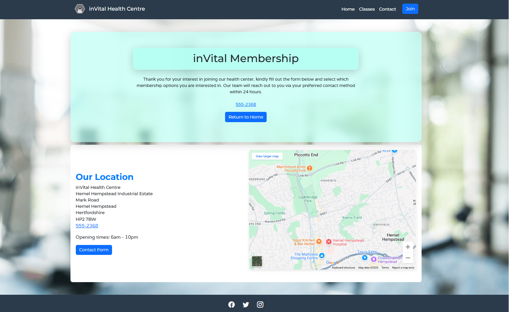

 - Success Message with phone link and return to index.html button.
 - Beneath message insert same contact box layout as contact.html.  

  

 - Scales down for tablet.

  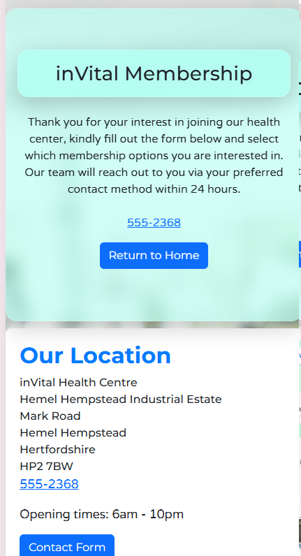

- Stacks vertically for mobile.
 
## Contact Form
-Simple form page with CTA button directing to success.html. 
-All fields mandatory and validation format correct for each field. (ie email must have an @ in it)

-  Bootstrap 5 elements broken down in this sheet [Contact Form Bootastrap Elements](https://docs.google.com/document/d/1tST-KRPXV6kTPkd2zjjJlJLHd1KfleX0C8LjhUV5xd4/edit?usp=sharing)

  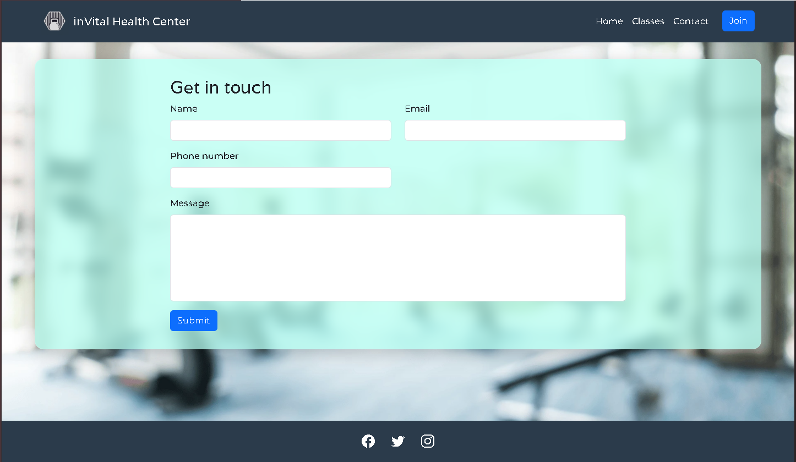

  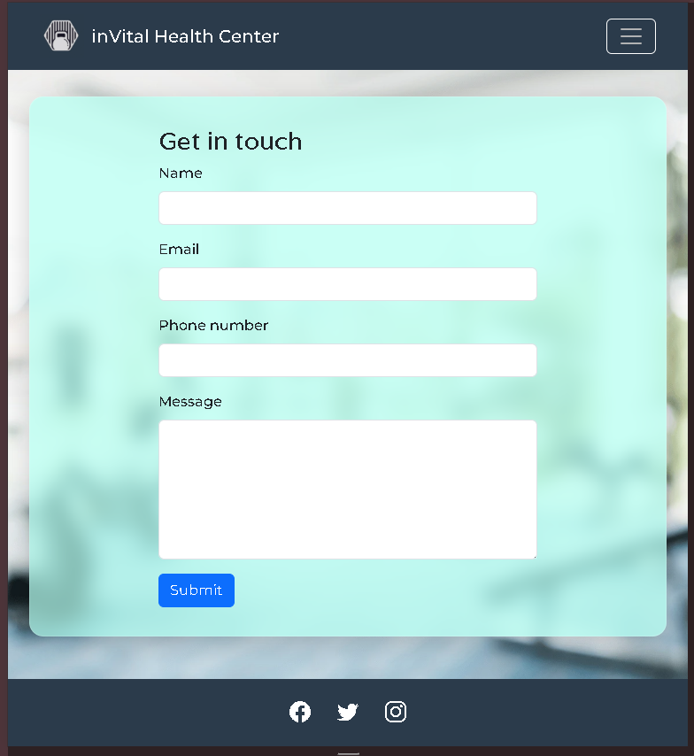

  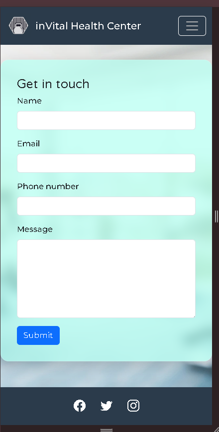

## Feature Ideas
### Future Developement Ideas
- A 360 degree tour allowing users to interact with their virtual tour of the gym. Either through Googlemaps or a software company such as Kuula. (https://kuula.co/)
- Wider range of class information, such as timetables for existing members. 
- Account and Checkout functionality for memberships. 

----

# Technologies Used
## Languages
- [HTML](w3.org/standards/webdesign/htmlcss)
    * Page markup.
- [CSS](w3.org/standards/webdesign/htmlcss)
    * Styling.
- [Javascript](https://developer.mozilla.org/en-US/docs/Web/JavaScript)
    * Running functions for interactive components, AJAX, etc.

## Frameworks
- [Bootstrap4](https://getbootstrap.com/)
    * Used for basic styles and outline.
## Libraries
- [JQuery](https://jquery.com/)
    * Animations and click functions.
- [Google Fonts](https://fonts.google.com)
    * Font Styles and icons. 

## Platforms
- [Github](https://github.com/)
    * Storing code remotely and deployment.
- [VS Code](https://code.visualstudio.com/)
    * IDE Environment. 

## Other Tools
- [Balsamiq](https://balsamiq.com/)
    * To create wireframes.
- [Coolor Picker](https://colorpicker.tools/)
    * Creating color pallettes.

----

# Testing
## Methods

- [Full testing external mastersheet](https://docs.google.com/spreadsheets/d/1MpcjnFR0sRtm0FBuqfoiV8ybn5v_BY5CXubD8ImN6pg/edit?usp=sharing).

### Validation

- HTML has been validated with [W3C HTML5 Validator](https://validator.w3.org/).
- CSS has been validated with [W3C CSS Validator](https://jigsaw.w3.org/css-validator/) and auto-prefixed with [CSS Autoprefixer](https://autoprefixer.github.io/).

### General Testing

- The site was sent to friends for feedback and testing.
- All forms have validation and will not submit without the proper information.
- Youtube Video embed functionality tested.  
- Map interaction controls fully tested. 
- External links open in a new tab.
- Font and color placement.
- Image resolutions intrinsic vs rendered checekd. 
- adhoc troubleshooting with the aid of Code Institute Network and https://www.stackoverflow.com. 

### User Stories Testing
- 1. "As a user interested in joining a gym, I want an easy to navigate website with all the information easy to find."

Acheived by:
  -Hompepage design and navigation. Home page designed so that landing view provides all the neccessary links in the navigation
  -Service cards providing additional information with links to these pages also. 

  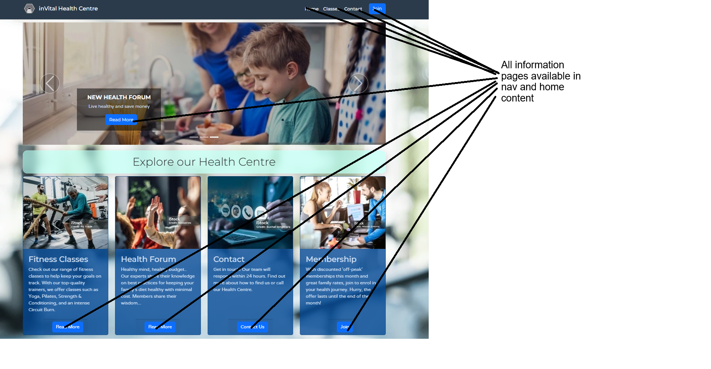

- 2. "I expect to be able to find out what facilities and classes the gym has."
  - Homepage-Classes Navigation 
  

  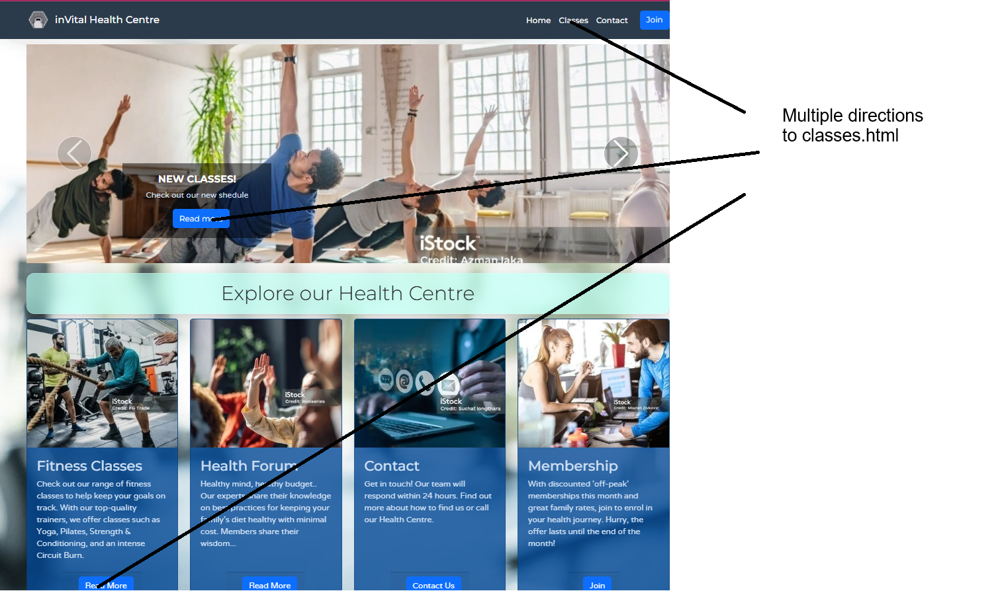

  -'Take the Tour' youtube video giving the user a guided tour of the gym. 
  

  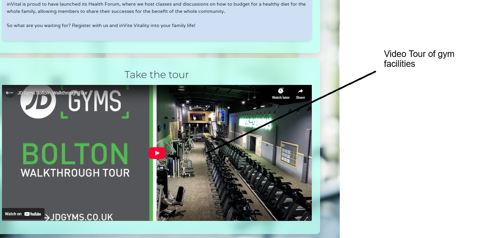

  
  

- 3. "I expect to be able to register to join as a member."
  - 'Join' Call to action clearly displayed in the navigation as well as service card. 
   

  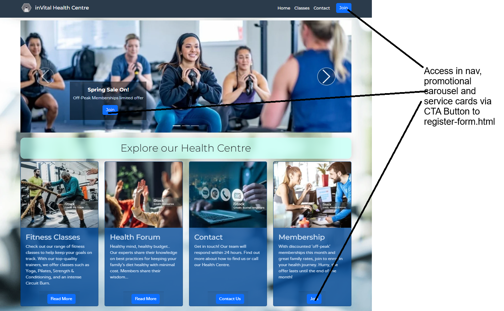

- 4. I expect to be able to contact and find the health centre.
   - 'Contact' Call to action clearly displayed in the navigation as well as service card. 

    

  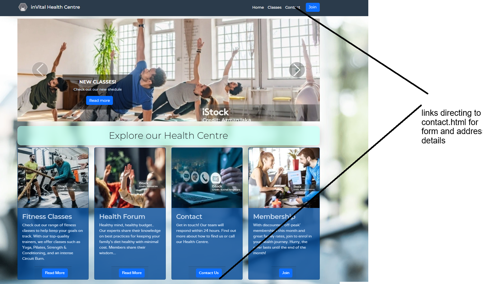

  

  

- 5. I expect to see imagery which is health focussed. 
  - Design choices: lifestyle imagery, background, blue & green color scheme, large focus on the 'Health Forum' class promotion.

    

  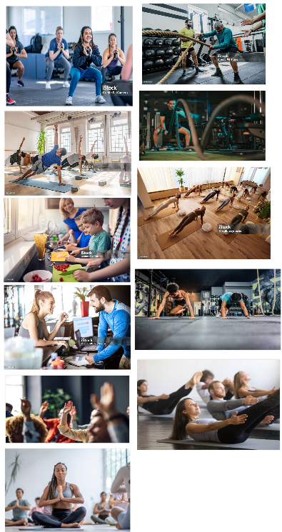

 
    

  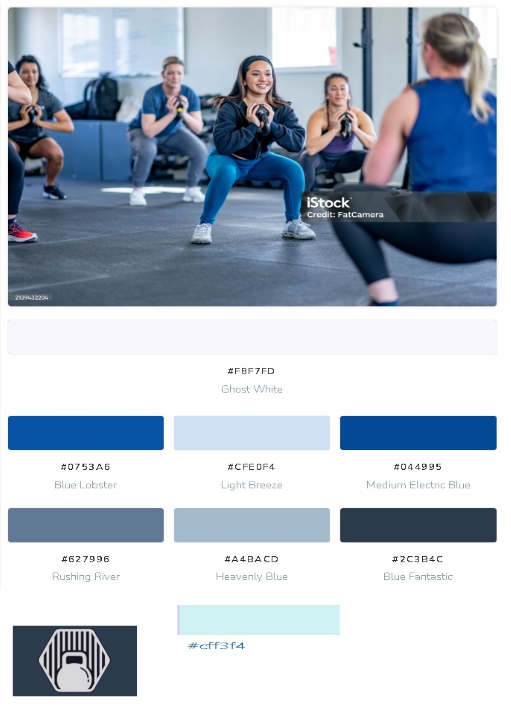

 

- 6. I expect to be able to read more detailed information about the classes.

   - Designated 'Classes' page (classes.html) detailing the activity, providing external wikipedia links for more information. 

       

  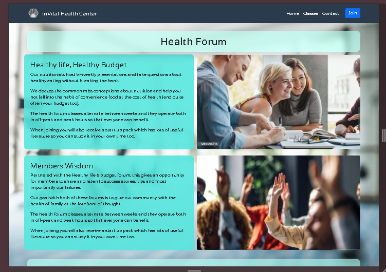

 

- 7. I expect to be able to follow the health centre through social media.
   - Social media icons clearly displayed centred in the footer. 

       

  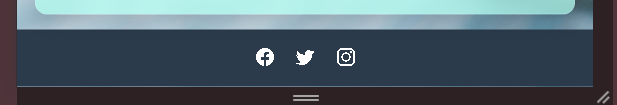

  

### Mobile Testing
- I tested the site personally on my Android Galaxy S24 device, going through the entire process, checking buttons, functions  out, etc. I was personally unable to test on iOS.
- The site was sent to friends and relatives for them to follow the same process. They have tested on their devices, including iOS.
- Chrome was utilised to inspect the site in mobile format, going through the pages and functions.

### Desktop Testing
- The majority of testing occurred on Chrome.
- The site was tested by friends and relatives on numerous desktop devices.
- The sites functionality and navigation have been tested on Chrome, Firefox and Edge. 
- Internet Explorer was not tested and the site was not developed with it in mind as support for the browser is gradually being dropped.

### Functionality and Navigation by Browser and Device

  

  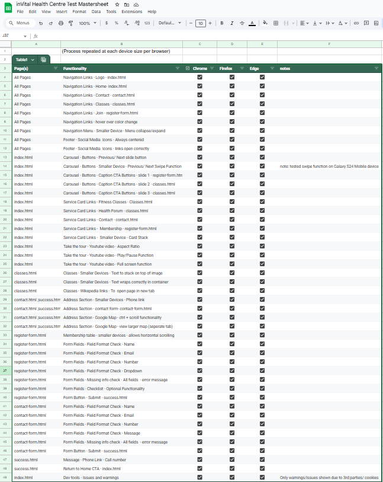

- [Full testing external mastersheet](https://docs.google.com/spreadsheets/d/1MpcjnFR0sRtm0FBuqfoiV8ybn5v_BY5CXubD8ImN6pg/edit?usp=sharing).

### Lighthouse Testing 
*Summary screenshots show both mobile (Left) and desktop (Right) report summaries. 
- [Full testing external mastersheet](https://docs.google.com/spreadsheets/d/1MpcjnFR0sRtm0FBuqfoiV8ybn5v_BY5CXubD8ImN6pg/edit?usp=sharing).

## index.html

  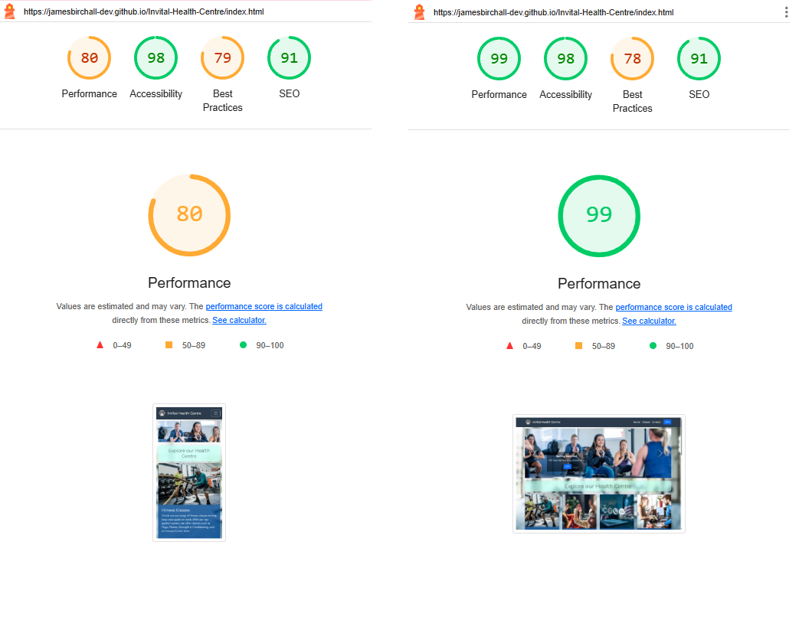

## classes.html

  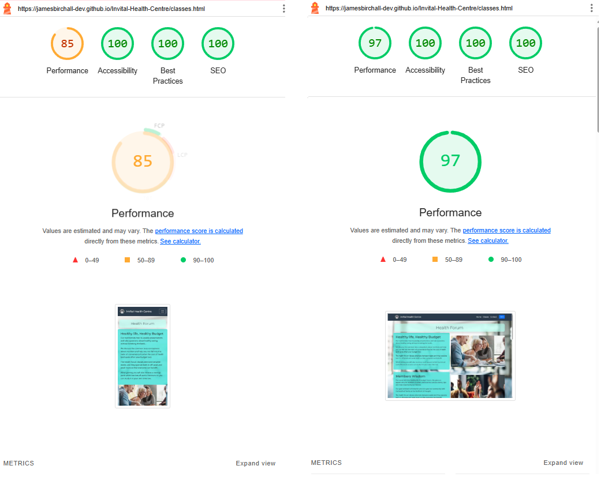

## contact.html

  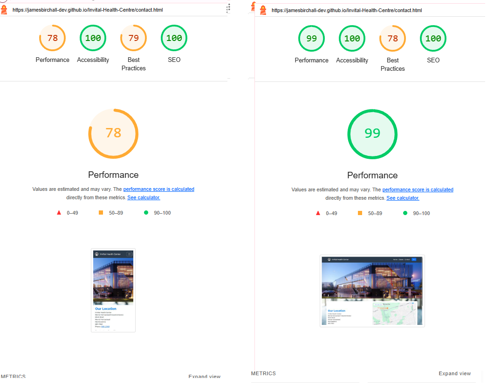

## contact-form.html

  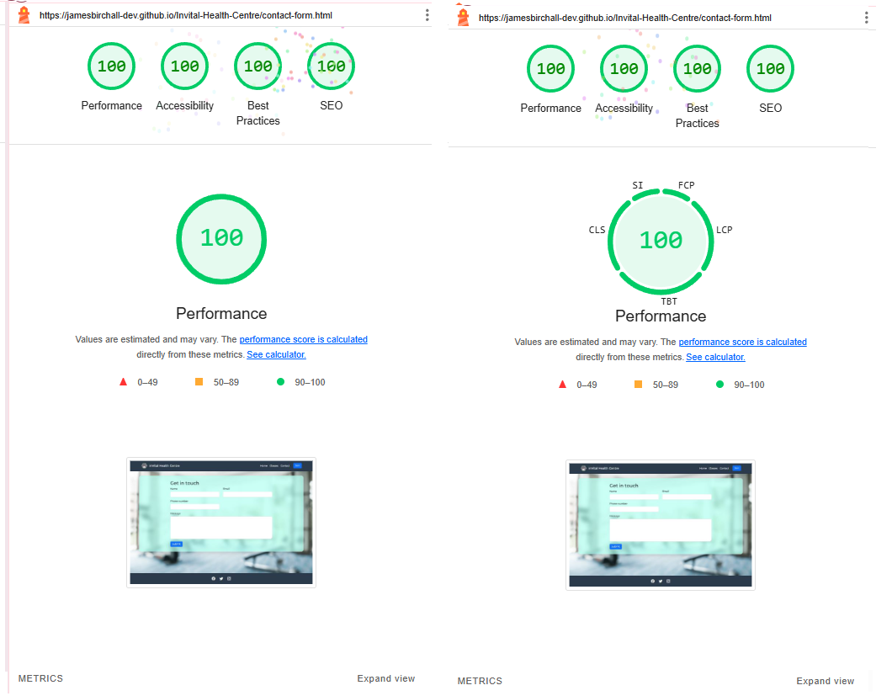

## register-form.html

  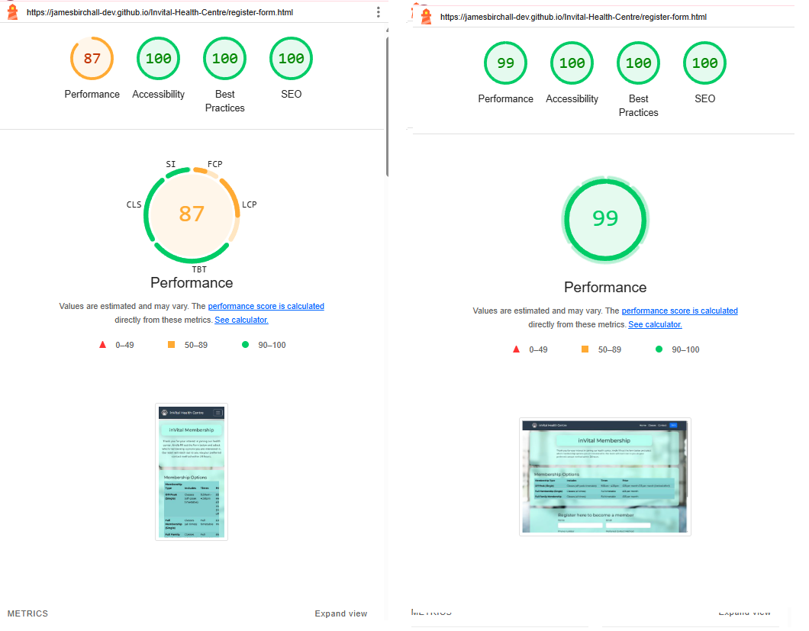

## success.html

  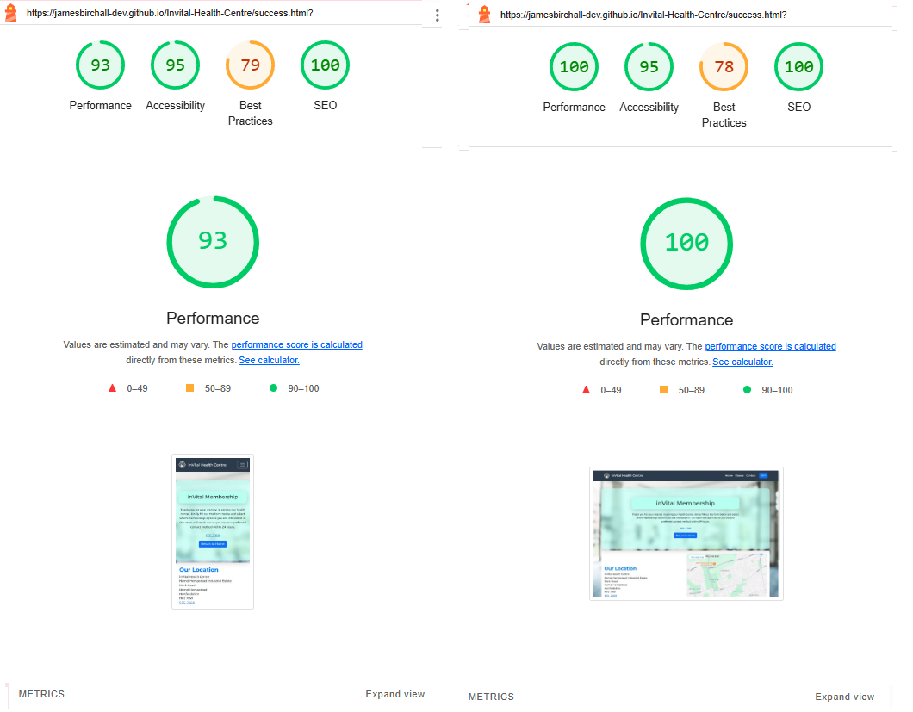

## Lighthouse Warning and Issue Resolution
Please see [Full testing external mastersheet](https://docs.google.com/spreadsheets/d/1MpcjnFR0sRtm0FBuqfoiV8ybn5v_BY5CXubD8ImN6pg/edit?usp=sharing). Lighthouse-tab for more information. 
### #1
- Page: classes.html 
- Section: Accessibility
- Type: Warning
- Message: 'Heading elements are not in sequentially-descending order.  '
- Source: H3 Headers in class text. 
- Action: Update to H2 Headers
- Status: Resolved 

### #2
- Page(s): contact.html ; success.html
- Section: SEO
- Type: Warning
- Message:  Background and foreground colors do not have sufficient contrast ratio. 
- Source: Address and Google map background against phone text. 
- Action: Update color to white for full contrast. 
- Status: Resolved 

## Bugs
No bugs have been identified in testing. 

# Deployment
## Local Deployment
### Local Preparation
**Requirements:**
- An IDE of your choice, such as [Visual Studio Code](https://code.visualstudio.com/)
- Github Account

## Github Deployment

### Github Instructions
1. Log in to your GitHub account.
navigate to [[https://github.com/Ri-Dearg/neverlost-thrift](https://github.com/JamesBirchall-dev/Invital-Health-Centre)](https://github.com/JamesBirchall-dev/Invital-Health-Centre).
1. You can set up your own repository and copy or clone it, or you fork the repository.
2. `git add`, `git commit` and `git push` to a GitHub repository, if necessary.
3. GitHub pages will update from the master branch by default.
4. Go to the **Settings** page of the repository.
5. Scroll down to the **Github Pages** section.
7. Select the Master Branch as the source and **Confirm** the selection.
8. Wait a minute or two and it should be live for viewing. See my own [here](https://jamesbirchall-dev.github.io/Invital-Health-Centre/).

## Credits and Contact
### Content
Imagery was almost exclusively obtained through [istockphoto](https://www.istockphoto.com/).

### Contact
Please feel free to contact me at `jamesbdorel@gmail.com`

